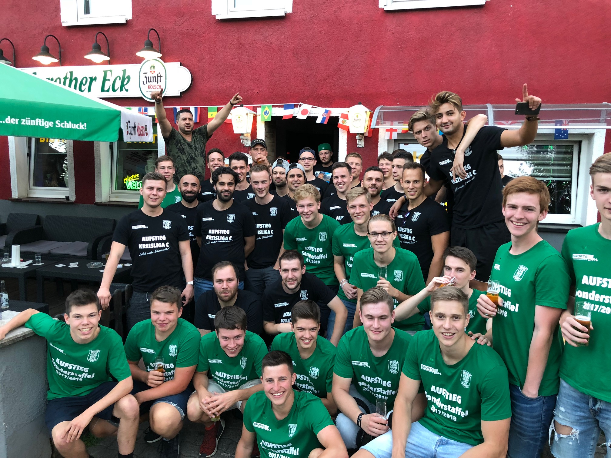

Die zweite Mannschaft hat unter Coach Lombardo als Aufsteiger mit einer neuen, jungen Mannschaft für Aufsehen in der Kreisliga C gezeigt. Mit 30 Punkten aus 16 Spielen konnte man sich vor allem fußballerisch beweisen. Lediglich in den letzten Spielen schwächelte die TSV Reserve ein wenig und rutschte vom Ersten auf den fünften Platz ab. Trotzdem ein Ergebnis zur Winterpause, dass nicht jeder so von einem Aufsteiger erwartet.

In der Winterpause konnte Coach Lombardo bereits einen Neuzugang feiern. Die Tormaschine der vergangenen Saisons, Kevin Klekotta, der für den TSV in 30 Pflichtspielen 47 Tore erzielt hat kehrt, nach halbjähriger Pause wieder zurück.

Die Vorbereitung fängt parallel zu den anderen Seniorenmannschaften am 05.02.19 an und ist mit vielen Fitness und Konditionseinheiten gut bestückt. Gerade die Fitness ist ein wichtiger Bestandteil von Lombardos Spielidee und nötig, um sich in der Kreisliga C oben festzusetzen.

Als Ziel ist festgelegt die oberen Tabellenplätze weiter anzugreifen und für Furore zu sorgen.
Dabei wird es vor allem gegen Frömmersbach und die Reserve aus Marienheide schwer, welche beide von Lombardo als Favorit für den Aufstieg angesehen werden.
 
***#nurdertsv #zweite #aufsteigerrasiert***

